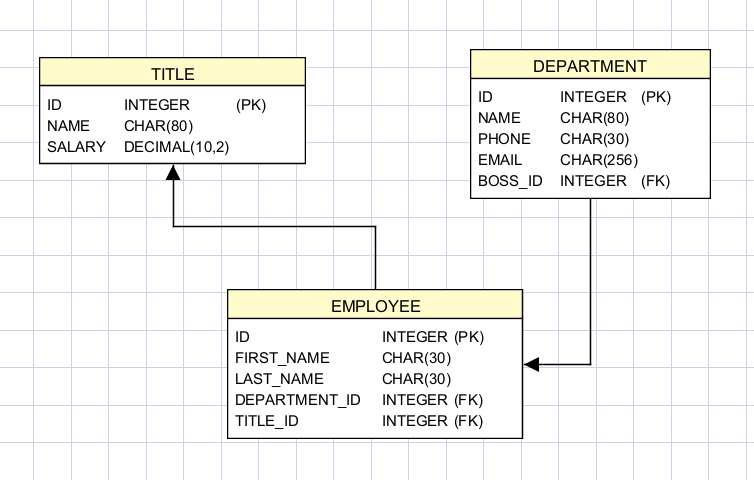
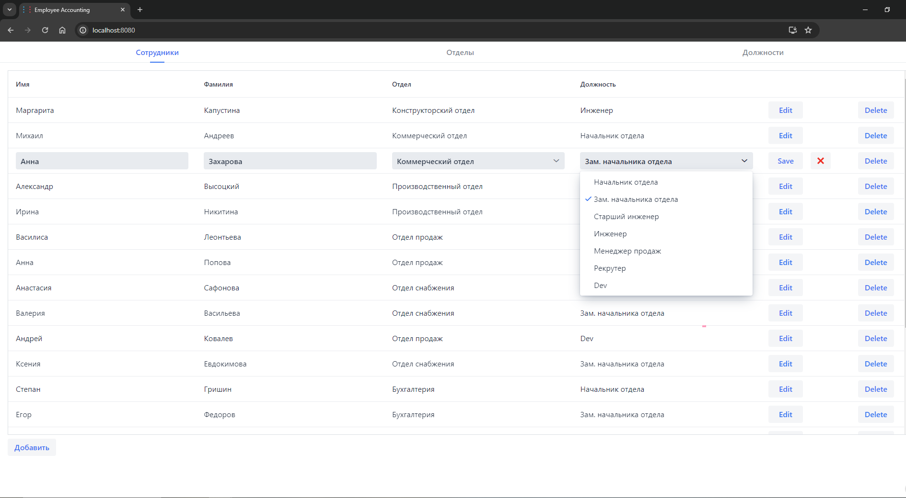

# Employee Accounting App

## Description
Simple App to control organisation structure based on employee, title and department relationships.
### Requirements
- Company contains multiple departments (like accounting, support, etc.). 
- Department has a boss with his title(director, engineer, etc.)
- Department has multiple employees.
- Department has own phone and email assigned.
- Employee receives payment based on title.

## Project structure
### Technology stack
- [Vaadin 14](https://vaadin.com/)
- [FirebirdSQL](https://firebirdsql.org/)
- [Maven](https://maven.apache.org/)
- JDBC
- [JUnit5](https://junit.org/junit5/)

### Database structure

## Run
### Run host
Run using `mvn jetty:run` and open [http://localhost:8080](http://localhost:8080) in the browser.

### Run unit tests
Run using `mvn test`

## Screenshots

